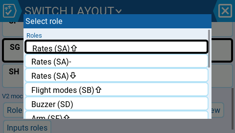
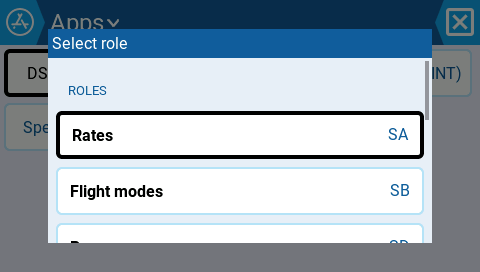
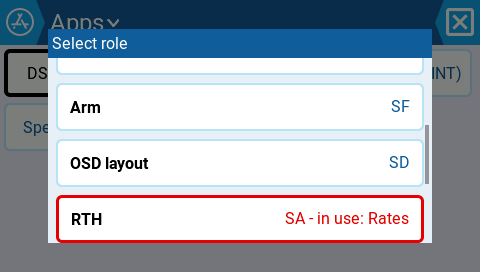
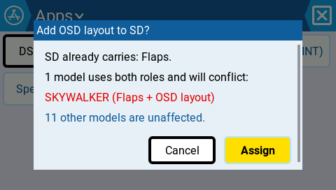
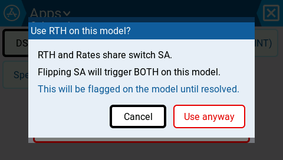
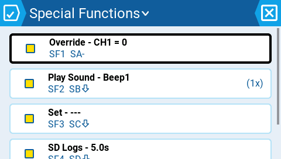

# Proposal: Enforced UI Design System (awaiting approval; foundation implementation in progress)

**Physics first:** 480×272 on 4.3" = 128.3 PPI → **1mm ≈ 5px**. Touch floor **40px = 8.0mm** on both axes (gloves + vibration push above the 7mm industry bottom; 272px of height forbids the 9mm top), mechanically clamped inside the DS layer — a screen *cannot* produce a smaller target through the API. Adjacency owned by containers: interactive edges ≥8px apart, ≥12px when either target is at the floor. Spacing scale: 0/4/8/12/16/24px, values private to the DS layer. Full spec: [DESIGN_SYSTEM.md](DESIGN_SYSTEM.md).

## Before / after (real TX16S simulator captures)

### Role picker (the "squashed" screen)
| Before | After |
|---|---|
|  |  |
| 29px overlay rows | `ds::PickerOverlay`: 48px options, section header, trailing switch badge |

Conflicted role: warning text + 3px border (non-color cue), reached by real drag.

### Layout-edit impact dialog
| Before | After |
|---|---|
|  |  |
| Crammed | `ds::Dialog`: 16px frame, 8px line rhythm, right-aligned actions |

### Conflict acknowledgment
| Before | After |
|---|---|
|  |  |
| | "Use anyway" in destructive role, 40px actions |

### Real production screen: Special Functions
| Before | After |
|---|---|
|  |  |
| 32px (6.3mm) rows, 16px checkboxes | 52px two-line DS rows: leading enable toggle (40×40 hit area), bold title, muted "SF1 SA-" subtitle, trailing repeat |

## Enforcement — three layers

1. **API shape**: DS components accept no rects, paddings, or positions — "just add a margin" has nowhere to land.
2. **Mechanical clamp**: 40px minimums + hit-area expansion inside `libui/ds_core.cpp` — even a DS bug can't render a sub-floor target.
3. **CI guard with ratchet**: `tools/design-system/check_design_system.py` scans all colorlcd code outside the allowlisted layer for raw pad/margin/position calls and ad-hoc constants. Baseline committed (**1280 violations / 139 files**); any file exceeding its baseline **fails the build**; decreases tighten the ratchet. Demoed: seeded violation → exit 1 with file:line; clean → exit 0.

## Components

`ds::List` · `ds::ListRow` · `ds::RowContent` (migration bridge for legacy rows) · `ds::SectionHeader` · `ds::Dialog` · `ds::DSButton` (primary/secondary/destructive) · `ds::PickerOverlay` — prototyped and running; `ds::FormRow` · `ds::Card` · `ds::EmptyState` — spec'd. Type roles ride existing fonts (FONT_XXS banned in screens); colors ride the merged token system.

## Phases

1. Land layer + guard with today's baseline (nothing breaks; nothing new gets in).
2. New/touched screens are DS-only, enforced automatically.
3. Migrate by template: list pages → form pages (build `FormRow` first — largest surface) → dialogs → pickers; each migration lowers and re-commits the baseline.
4. Absorb legacy primitives; retire public padding types.
5. Zero-violation directories become zero-tolerance.

## Open questions

1. Heavy list pages (20+ mixes): accept ~4 two-line rows/screen, or add a sanctioned `Compact` one-line 40px variant?
2. Extend the palette contrast auto-correction to validate button fills per theme?
3. Portrait/other targets: per-component handling inside the DS layer (assumed), or a portrait grid spec now?
4. Ratchet policy: "any PR touching a legacy screen must lower its count," or only forbid increases?
