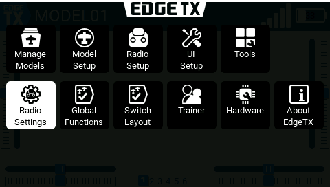
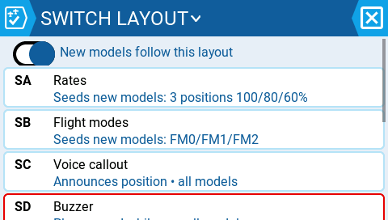
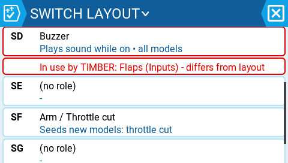
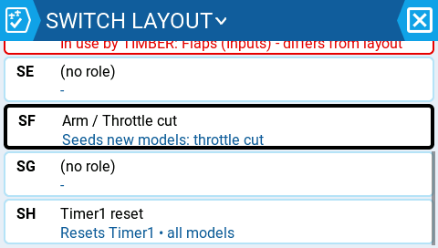
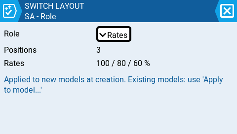
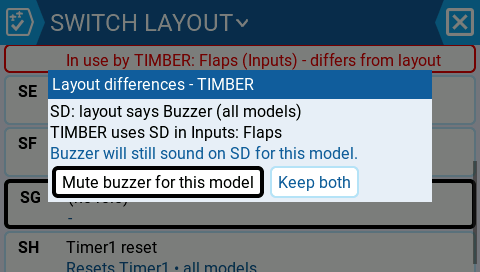
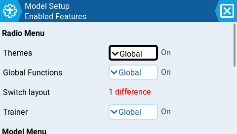
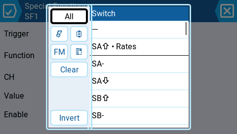

# Proposal: Switch Layout — inheritable switch meanings (awaiting approval)

*"I tell the radio once what each switch means; the radio labels it everywhere, wires up the sounds and announcements for all models, sets up new models to match — and warns me when a model disagrees."*

One radio-level page assigning a **role** per physical switch. No runtime indirection — models keep storing plain raw switches, so every model stays fully portable to any radio, Companion, or upstream EdgeTX. A role acts through four mechanisms: **declare** (labels in every picker), **do** (radio-side behaviors as managed Global Functions), **seed** (model-side config generated at model creation / explicit apply), **audit** (divergence visible, never auto-fixed).

## The page

| | |
|---|---|
|  |  |
| "Switch Layout" beside Global Functions | Per-switch role cards; "New models follow this layout" toggle |
|  |  |
| Each card says its mechanism in plain words | SD card flagged: "In use by TIMBER: Flaps (Inputs) — differs from layout" |

## Editing a role / resolving divergence

| | |
|---|---|
|  |  |
| SA: role + seed options + when it applies | Conflict in plain language: "Mute buzzer for this model" / "Keep both" |
|  |  |
| Model Setup shows "Switch layout: 1 difference" | Every switch picker annotates: "SA⇧ • Rates" |

## Safety semantics

- Inherited behavior is never **added** to a model silently (radio-side roles are Global Functions — same scope as today, now visible and individually mutable per model).
- Inherited behavior is never **removed** silently (model config only changes via explicit "Apply to model…" with a preview diff).
- Changing the layout later never mutates any model — models just show "differs" until the pilot re-applies.
- Zero migration: existing models load unchanged.

## Phases

1. **Phase 1 (~80% of value, no model-storage changes):** layout page + radio.yml section + managed Global Functions for callout/buzzer/timer roles + picker annotations. The 34-tap-per-model callout case becomes: tap SA → role "Voice callout" → done, all models.
2. **Phase 2:** new-model seeding + per-model "Apply to model…" with diff preview (plain config output).
3. **Phase 3:** divergence audit + per-model per-function mute mask (also fixes today's all-or-nothing Global Functions opt-out).

## Rejected alternatives (and why)

- **True semantic roles (runtime indirection):** a model YAML containing `ROLE_RATES` silently collapses to "no switch" on any radio/Companion/upstream lacking the layer — a silently disarmed switch is a crash contributor. Also makes layout edits silently mutate all models.
- **Auto-sync / auto-repair:** flight-critical config must only change on explicit, previewed action.
- **Template model alone:** helps only new models, no visibility of divergence, over-copies (protocol, channels).

## Open questions

1. Ship the per-model per-function Global-Functions mute earlier as its own feature?
2. Should "Apply to model…" ever *remove* previously-seeded config (with preview), or stay strictly additive?
3. Rates seeding: one opinionated default (100/80/60 + expo) or the small per-role seed editor as prototyped?
4. Divergence check scope: only deterministic collisions (role-switch used in the model's mixer), or also "model doesn't use the rates switch at all" (noisier)?
