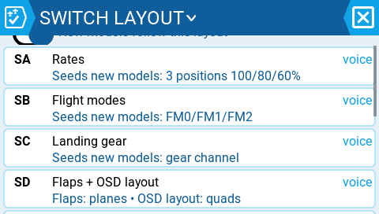
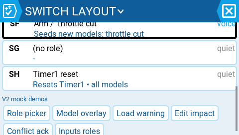
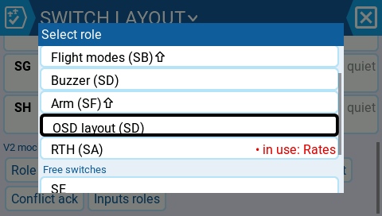
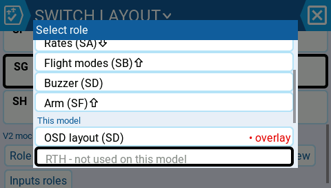
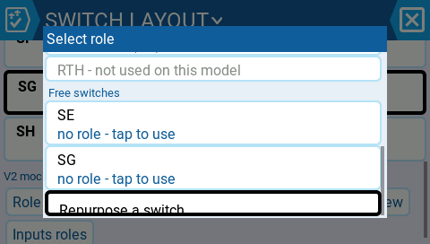
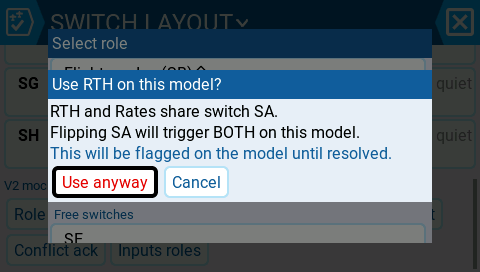
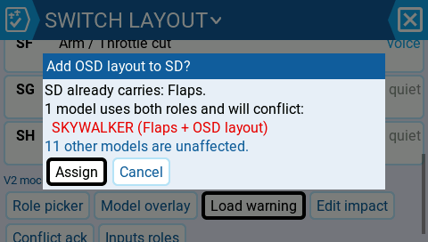
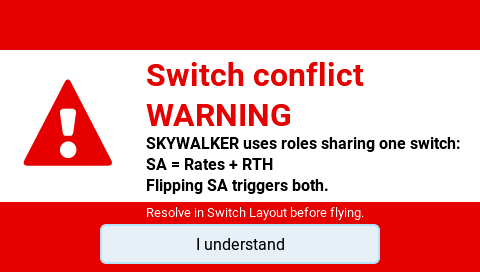
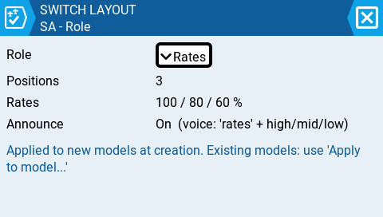
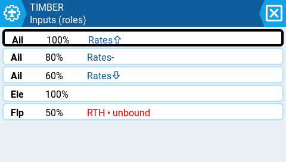

# Proposal: Switch Layout v2 — roles-only + global co-assignment (awaiting approval)

*"Every switch function has a name; the radio knows which switch each name lives on; my models only speak in names — so a switch never surprises me, and the radio tells me out loud what a flip just did."*

Supersedes v1. Models reference **roles only**; role→switch assignment is exclusively global (radio-level); one switch may carry **several roles** (SD = Flaps + OSD layout) because no single model uses all roles. A *conflict* exists only when one model actively uses two exclusive roles resolving to the same switch — caught at three gates. Flip-time voice announcement of what the switch does *on this model* is a built-in layout property.

## The layout page — co-assignment

| | |
|---|---|
|  |  |
| SD carries "Flaps + OSD layout" (Flaps: planes • OSD layout: quads); per-card voice indicator | Momentary roles default quiet |

## The model-side picker — roles as the only currency

| | |
|---|---|
|  |  |
| Roles with global resolution ("OSD layout (SD)"), free-switches section, live conflict mark "RTH (SA) • in use: Rates" | Role picker views |
|  |  |

## Conflicts — three gates

| Gate 1: config time | Gate 2: layout edit | Gate 3: model load |
|---|---|---|
|  |  |  |
| "RTH and Rates share switch SA. Flipping SA will trigger BOTH." Use anyway / Cancel | Adding OSD layout to SD: "SKYWALKER would conflict; 11 other models unaffected" | Stock-style full-screen alert for imported/unresolved conflicts |

## Announcements & degraded states

| | |
|---|---|
|  |  |
| Per-role Announce with voice ladder (clip → curated → letters → earcon; never silent by accident) | Unresolvable role ref = inert-but-flagged ("RTH • unbound"), never silently dropped |

## Key mechanics

- **Role classes:** *control* roles (Rates, Flaps, Arm, RTH, FM — exclusive per switch per model) vs *event* roles (log, screenshot, timer, buzzer — stack freely; "flip rates ⇒ start logging" is a feature, not a conflict).
- **Portability (dual-write):** canonical YAML field always stores the resolved raw switch (any EdgeTX build reproduces behavior-as-of-last-save); a sibling role key + layout stamp let this fork arbitrate: external raw edit wins (flagged, one-tap convert); layout-moved-since-save → role wins with a notice listing what moved.
- **No silent drops, ever:** unknown/unresolvable role refs are preserved and flagged (vs. today's silent SWSRC_NONE collapse); unknown roles from imported models are auto-created as unassigned.
- **Migration without guessing:** legacy raw refs display as identity auto-roles; per-model "Convert to roles…" with preview; duplicate hand-built callout SFs flagged with previewed one-tap disable (reversible).
- **Scarcity endgame:** any per-model remap is expressible as an extra *global* alias role ("Rates B — SG") — visible on the layout page; no hidden per-model remapping mechanism exists at all.

## Invariants (enforced)

1. A role resolves to exactly one global switch for every model, always; moving it moves it everywhere, after an impact preview.
2. No hidden remapping: cross-model divergence exists only as acknowledged, badged, exclusive co-use.
3. A flip announces what it actually does on this model (or a deterministic earcon); silence only by explicit opt-out.
4. No reference is ever silently dropped.
5. Saved YAML always carries full raw resolution — any EdgeTX build reproduces behavior-as-of-last-save.

Honest limits: Lua reading raw switches, per-model CFS hardware, and intent-arbitration when both layout and file changed externally are outside the guarantee.

## Phases

1. **Role registry + layout page + picker annotations + flip announcements** (no model-storage changes; kills the 34-tap callout case and delivers wrong-switch protection on its own).
2. Roles in model refs (dual-write, resolution layer, identity auto-roles, convert assist, seeding).
3. Conflict machinery (used-roles index in labels cache, three gates, badges, audits).
4. Polish: alias-role flows, clip management, Companion support.

## Open questions

1. Gate 1 strength: acknowledge-and-badge, or hard block with alias-role as the only path?
2. Announcement defaults for high-frequency switches (FM/rates): all-on with per-role quiet, or curated quiet defaults?
3. "Convert to roles" radio-wide bulk (with per-model preview), or strictly per model?
4. Ship a curated starter role set with voice clips as the out-of-box layout, or start empty?
