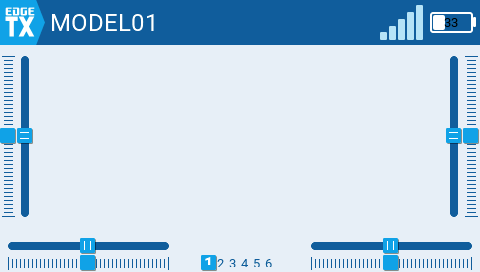
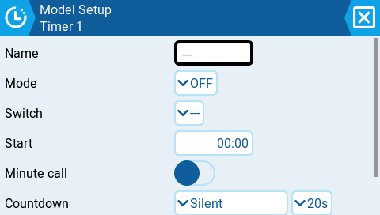
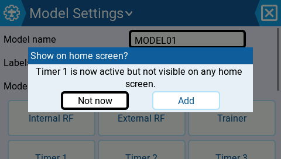
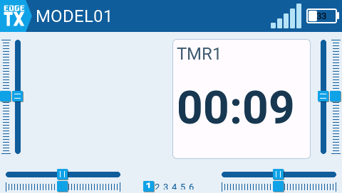
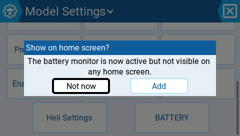
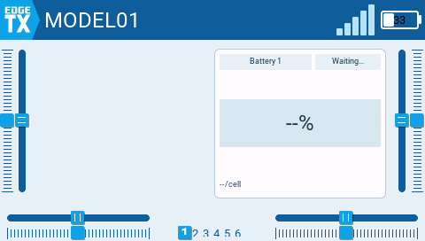
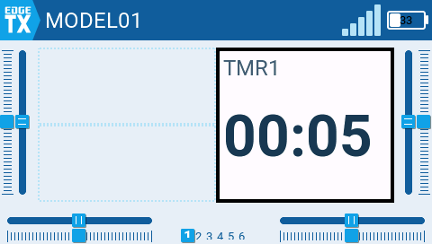
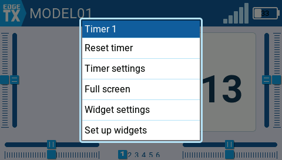
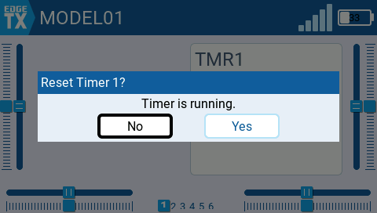
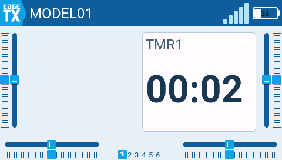

# Proposal: Visibility Bridge (awaiting approval)

Bridging configuration → home-screen visibility. Three connected pieces, one grammar: tap acts, long-press opens context. All screenshots are real TX16S simulator captures of a working prototype.

## Today's problem

| | |
|---|---|
|  |  |
| Timer configured — home screen shows nothing | Long-press on the canvas does nothing |

## Piece 1 — Post-setup offer

When you activate something glanceable (timer armed, battery monitor wired) and **leave the setup page**, a one-tap prompt appears. **[Add]** auto-places the right widget in the first free zone. Never interrupts mid-configuration, never auto-replaces an existing widget (slots full → button becomes **[Choose slot]**), "Not now" suppresses permanently per item, stray tap-outside is only a soft dismiss.

| | |
|---|---|
|  |  |
| Timer page where mode is set | On leaving: "Show on home screen?" [Not now] [Add] |
|  |  |
| One tap later: live timer widget on home | Same system for battery |

## Piece 2 — Home canvas long-press → widget setup

The screen that was 4 menus deep (Quick menu → UI Setup → Screen 1 → Setup widgets), one gesture away. Tap still opens Quick Menu.

## Piece 3 — Widget long-press → context menu with in-field reset

Menu titled with the item's identity; quick actions first. Stopped timer resets instantly (~1s total: long-press + tap). Running timer gets a one-tap confirm — losing live flight data takes three compounding accidents. Deliberately no "Remove widget" in the live menu.

| | |
|---|---|
|  |  |
| Long-press on timer widget | Confirm guard only while running |

## Open questions

1. After **[Add]**: jump to home screen to show the result, or stay on the settings page? (Prototype stays.)
2. Canvas long-press threshold: standard 400ms, or longer (~800ms) against pocket touches?
3. Should the free-slot search consider top-bar slots for timers?

~350 LOC net. One platform-wide change (long-press event bubbling, 3 lines) needs its own review pass — it is the fix for "long-press does nothing anywhere on the canvas".
