# Edge16 Design System — Migrated Screens

**2026-07-18**

This gallery is visual proof of the EdgeTX color-LCD design-system migration, captured live from the TX16S simulator built at commit `48c80f6fd4` (`ds-migration` branch — the full migrated design system: `ds_core` components plus migrated Special Functions, Outputs, Timer, Telemetry, USB Joystick, GVars, Logical Switches, form pages, and dialogs, with the CI design-system guard driven to **baseline 0**).

The design system enforces a **40px / 8mm touch floor** and consistent spacing through semantic-only components (`ds::List`, `ds::Grid`, `ds::FormRow`, `ds::Dialog`, `ds::EmptyState`, …) — no ad-hoc pixel styling. A CI guard with baseline 0 fails the build on any new ad-hoc styling that bypasses these components, so every screen below is guaranteed to be using the shared system rather than a one-off layout.

Every screenshot below was captured at the native 480x272 simulator resolution and upscaled 2x with nearest-neighbor sampling for crispness on modern displays (shown at 960x544). Screens are populated with real data (flight-mode GVar values, configured logical switches, live telemetry sensors, a bound battery pack, etc.) rather than empty defaults, so the layouts can be judged under realistic content.

---

### 1. Home screen

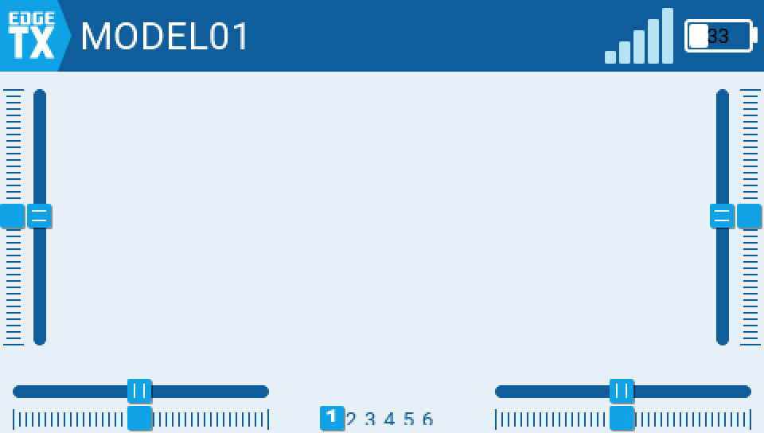

The main model view — context for the rest of the gallery; not part of the migration itself, shown for completeness.

### 2. Model Settings top page

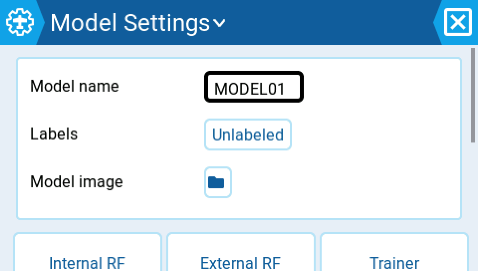

`ds::FormRow` gives every setting row (Model name, Labels, Model image, and the button groups below) the same 40px touch-safe height and label/control alignment.

### 3. Special Functions

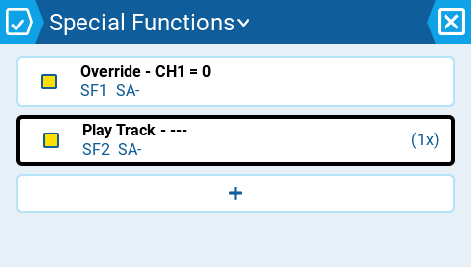

`ds::List` two-line rows (function summary + trigger/switch subtitle) with an inline enable toggle, each row a full-width 40px+ touch target. Two configured functions shown (Override and Play Track, both switch-armed).

### 4. Outputs (channel list)

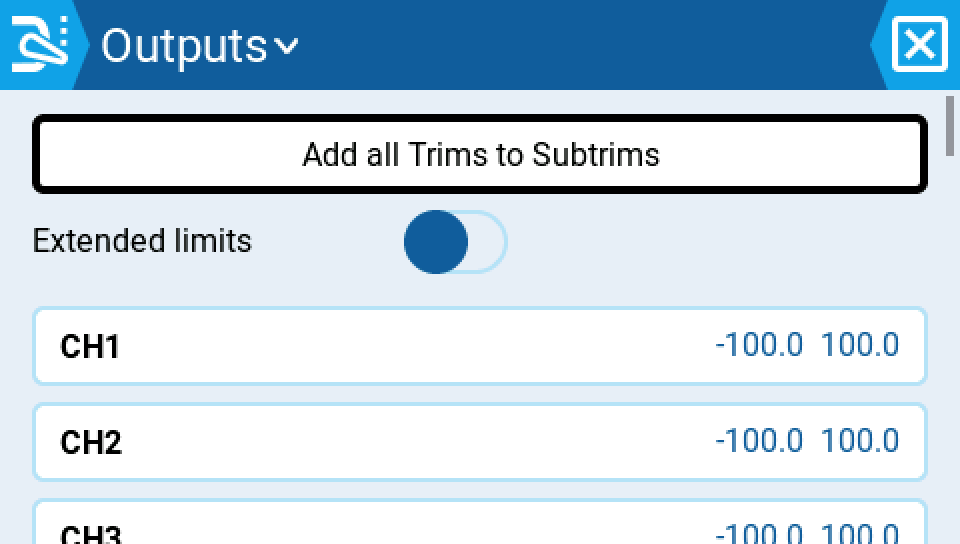

Migrated channel rows via `ds::List`/`ds::FormRow`, showing real per-channel min/max values (CH1–CH3) plus the page-level "Add all Trims to Subtrims" action and Extended limits toggle.

### 5. Timer 1 setup

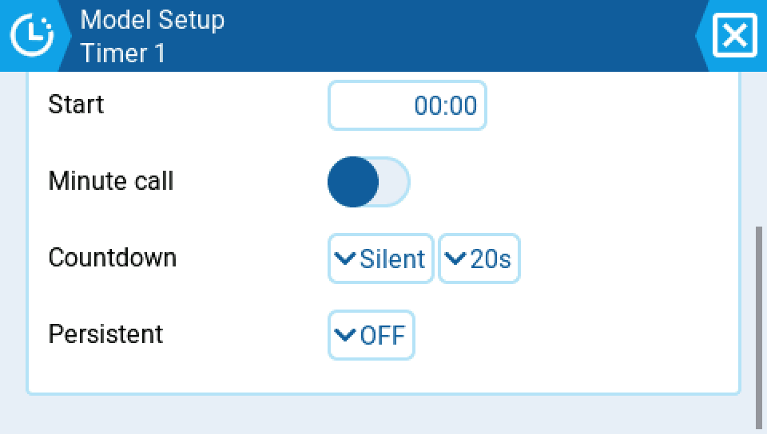

`ds::FormRow` layout for Timer 1: Mode set to ON, Start, Minute call, Countdown (Silent / 20s) and Persistent all laid out as consistent label/control rows.

### 6. Global Variables

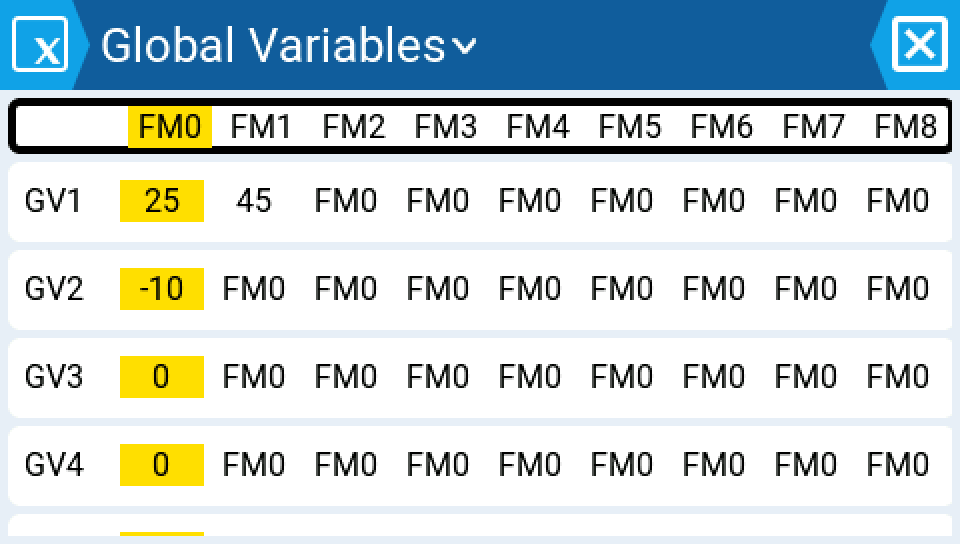

`ds::Grid` with a frozen FM0–FM8 header row locked directly above its per-flight-mode value columns — the header and every GV row share one column template, so this alignment can't drift. GV1 shows a base value of 25 with FM1 overridden to 45; GV2 shows -10.

### 7. Logical Switches

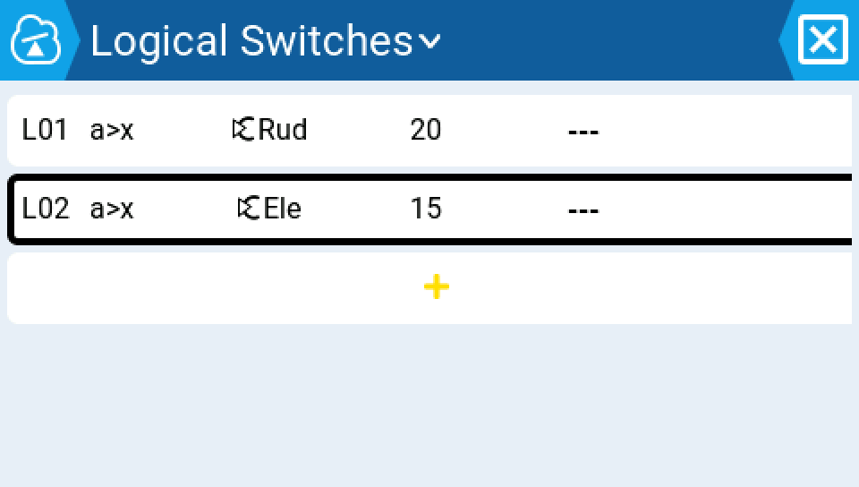

`ds::Grid` 7-column table (name / function / V1 / V2 / AND switch / duration / delay) restoring the tabular scan. Two configured switches shown: `L01 a>x Rud 20` and `L02 a>x Ele 15`.

### 8. Telemetry sensors list

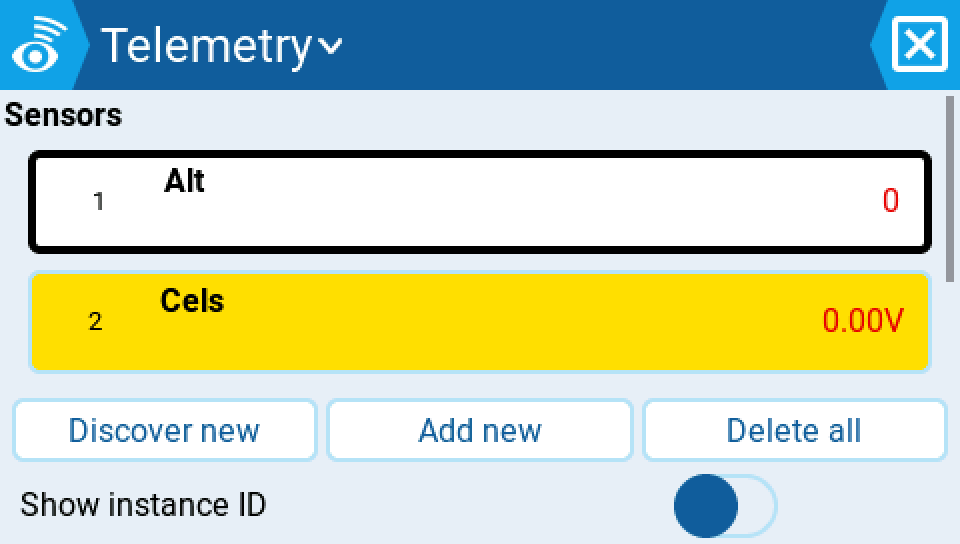

Migrated sensor list with two live sensors (Alt, Cels) showing real values, plus Discover new / Add new / Delete all actions.

### 9. USB Joystick channels

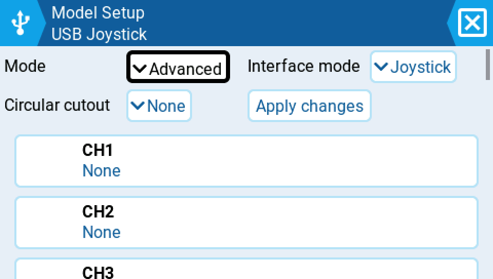

`ds::List` channel rows once Advanced mode is enabled, each row a full 40px touch target showing the channel's current axis/button assignment.

### 10. Radio Setup → Alarms

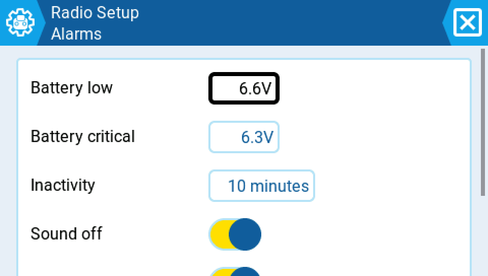

`ds::FormRow` layout on a Radio Setup sub-page: Battery low/critical thresholds, Inactivity timeout and Sound off toggle, each a consistent label/control row.

### 11. Battery monitor page

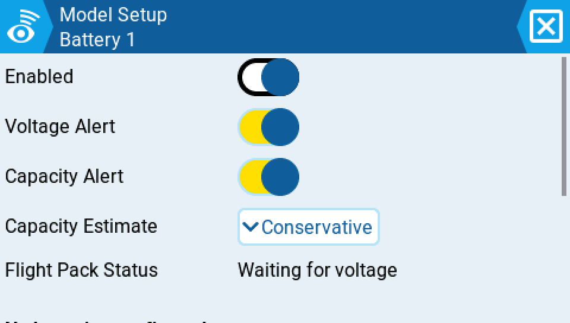

Battery 1 monitor page after binding a 4S LiPo/2200mAh pack: Enabled, Voltage Alert and Capacity Alert toggles, Capacity Estimate choice, and live Flight Pack Status, all on `ds::FormRow`.

### 12. Confirm dialog

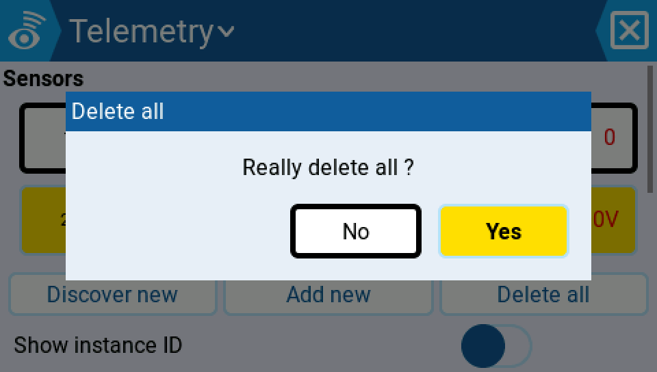

`ds::Dialog` confirm overlay ("Delete all" / "Really delete all?") triggered from the Telemetry sensors page, with clearly separated No/Yes actions — shown here, then cancelled to preserve the populated sensor list.

### 13. Switch picker overlay

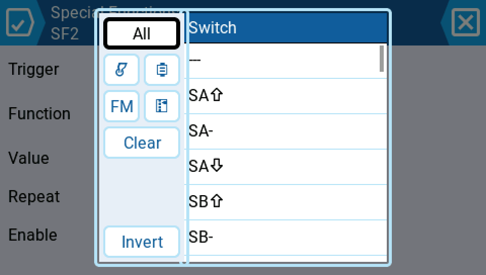

The Menu-based source/switch picker used when assigning a Special Function's trigger switch — unmigrated, shown for completeness as the picker surface the migrated screens hand off to.

---

## Verification

- All 13 screenshots were captured in a single simulator session built from the `ds-migration` branch.
- Every screenshot's companion metadata reports `git_commit: 48c80f6fd4`, matching the branch HEAD at capture time.
- Resolution: native 480x272, upscaled 2x nearest-neighbor to 960x544 for display crispness (applied consistently to all 13 images).
- Total gallery size: well under the 12MB budget (~240KB for all images combined).
