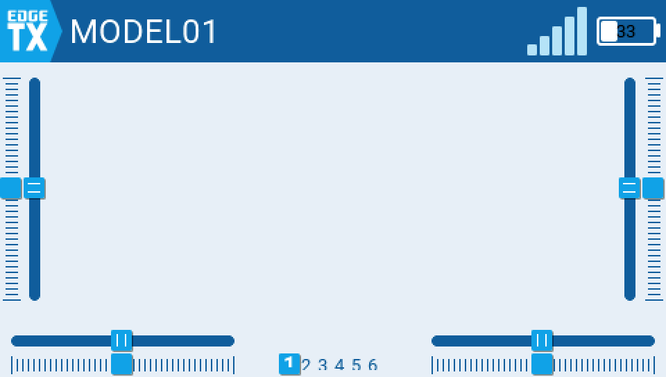
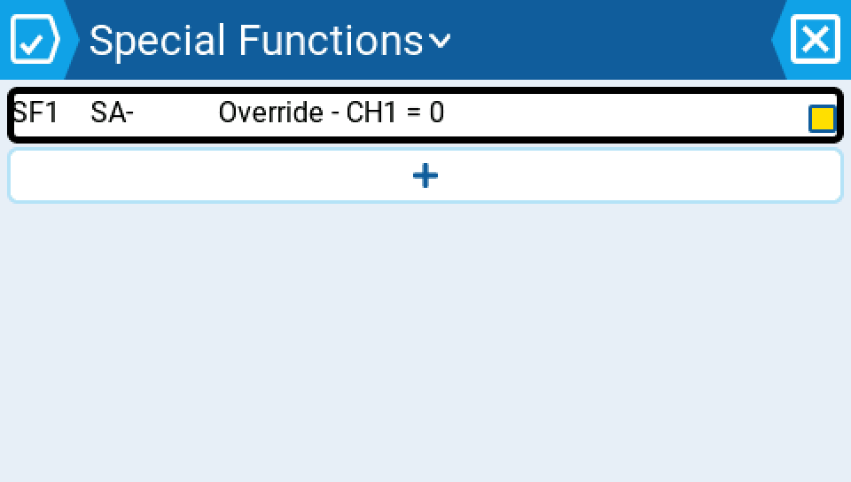
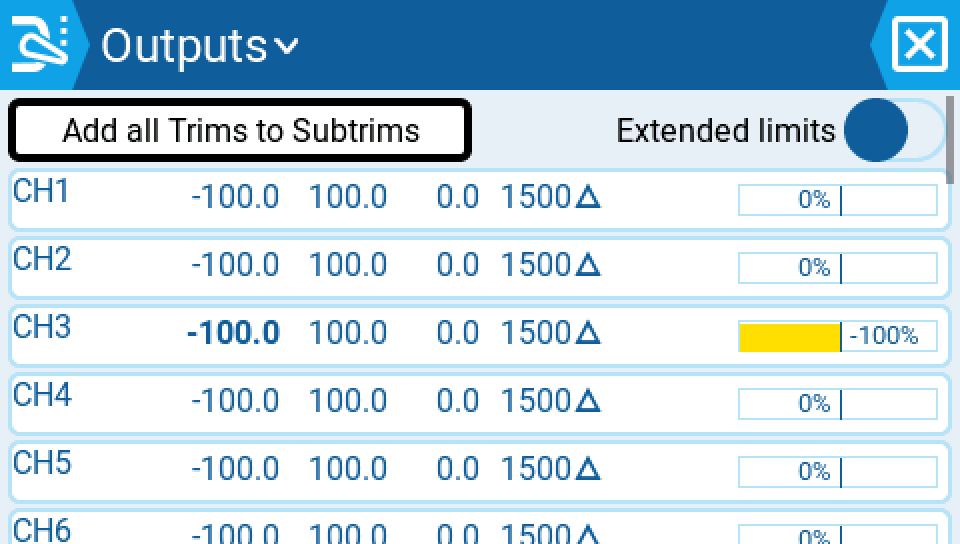

# Edge16 UX Changes — Animated Report

**Date:** 2026-07-17
**Branch:** develop @ `3f79d16876` (all clips captured live against this commit or later, in the UI harness simulator)

Each section below pairs a short animated GIF with the interactions it was captured from. All GIFs were recorded frame-by-frame from the TX16S UI harness simulator (native 480x272, upscaled 2x with nearest-neighbor for crispness) driving real touch, rotary, and key events — no synthetic frames.

A note on the last two entries: the general rule "tap = edit, long-press = menu" on list screens (Special Functions, Outputs, Mixes, etc.) is existing `develop` behavior, not new in this batch — it's called out here because it's a convention our own recent fixes (topbar/inputs work) had to preserve rather than accidentally break, and because it's the affordance every other clip in this report relies on. The keyboard-touch clip demonstrates the harness capability (`4b0a38942b`) that made capturing *all* of these clips as real touch/rotary interactions possible in the first place, rather than synthetic key injection.

---

### 1. Name-at-creation, zero backspaces

Creating a blank model used to hand you a generic `MODELnn` name that you'd have to select-all and retype. Now the "New Model → Blank Model" flow opens straight into the name dialog with the keyboard already up and the default name pre-selected, so the first keystroke replaces it outright — no backspaces, no extra taps to clear the field. Typing "Test1" and confirming shows the model immediately on the home screen and in Manage Models under its real name.

Commit: `cb77a30678`

---

### 2. Special Functions: new slot is enabled by default, no extra step

Adding a new Special Function slot now presets it to a safe no-op (no trigger switch assigned, so it can't fire) instead of leaving it in an ambiguous state. Setting the trigger to SA↑ and the function to Play Sound → Beep1 is all that's needed — the slot is already `enabled=1` when you back out to the list, with no separate "turn it on" step a pilot could forget in the field.

Commit: `cb77a30678`

---

### 3. Battery setup: 36 interactions down to about 7, with auto-bind

Configuring a battery pack for a fresh model used to be a long detour through Radio Settings' battery library plus manual sensor wiring. Now "Create battery" on the Model Settings → Battery page defaults straight to a sensible LiPo 3S 2200mAh pack, and once a single voltage sensor exists in Telemetry, the Voltage source binds to it automatically instead of asking you to pick it. With telemetry flowing, Flight Pack Status reads "LiPo 3S 2200 confirmed" — the whole setup collapses from roughly 36 taps to about 7.

Commit: `3f79d16876`

---

### 4. State-aware widget colors: navy / amber / red at a glance

The home-screen Value widget (bound to the monitored voltage sensor) and the Battery Monitor widget now share one source of truth for battery state coloring: navy/neutral above the warning band, amber border+tint in the 21-35% remaining band, and red border+tint at or below 20% remaining. Stepping telemetry voltage from 12.6V down to 10.3V and 9.6V and back demonstrates both widgets changing together in real time — a pilot glancing at the radio gets the same warning read from either widget, held long enough (~1.2s per state) to actually register at the field.

Commit: `39b4079d98`

---

### 5. Rotary precision: exact -0.1 steps, no sticky residue

Rotating the Outputs → CH1 Max roller one detent at a time used to jump by a full -1.0 and leave sticky residue behind (the displayed value and the stored value could disagree after a single click). Now each single rotary detent moves the value by exactly -0.1: 100.0 → 99.9 → 99.8 → 99.7, one detent per frame, matching what the pilot's thumb actually did.

Commit: `a917981de6`

---

### 6. Mis-tap safety: an outside tap always cancels, never commits

Opening the Mixer Weight roller, scrolling it up to a big accidental value like 190%, and then tapping outside the dialog (the scrim, not Cancel or Ok) now reliably discards the change — reopening the field shows the original 100% untouched. A stray tap outside a roller dialog can never silently commit a half-scrolled value anymore.

Commit: `ae74136562`

---

### 7. Tap to edit, long-press for the menu — everywhere on list screens

On the Outputs list (and other list screens across the color LCD UI), a plain tap on CH1 opens its editor directly, while a long-press on the same row opens the context menu (Edit / Reset / Copy axis to subtrim / …). This tap-vs-long-press split is existing `develop` behavior that our recent input/topbar fixes had to keep intact — it's the consistent touch convention every other clip in this report depends on.

Commit: existing `develop` behavior, preserved by our recent fixes (see intro)

---

### 8. Real touch in the simulator harness

The UI harness now delivers genuine touch-down/touch-up events into the simulator's LVGL input device, not synthetic key injection — this clip taps individual keys on the on-screen keyboard ("e", "d", "g", "e") to spell a word, with each character appearing after its own tap. This capability is what unblocked capturing every other clip in this report as a real interaction instead of a scripted shortcut.

Commit: `4b0a38942b`
