# Edge16 UX Fixes — Proof Report

**Date:** 2026-07-16 · **Target:** TX16S color LCD (480×272), simulator-verified

Five changes produced from a full touch-first UX audit. Every change was verified end-to-end in the simulator with raw touch/rotary input; the full gtest suite is green (454/454 where applicable). Each section shows before/after screenshot proof.

---

## 1. Simulator harness: touch injection fixed

*Landed on `main`, commit `4b0a38942b` (merged + pushed).*

Automation taps blocked the SDL main loop and only ever delivered the touch **release** to LVGL — no automated tap ever clicked. Fixed with frame-driven gesture injection matching real mouse input. This unblocked faithful touch testing for everything below.

| Before | Before |
|---|---|
| 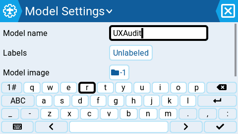 |  |
| Keyboard open, about to tap `q` | After the tap: text unchanged, no character typed |

| After | After |
|---|---|
| 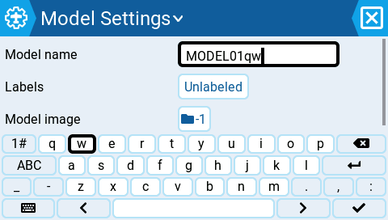 | 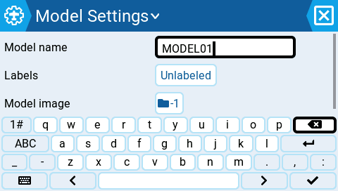 |
| Raw taps type: field shows `MODEL01qw` | Backspace taps restore `MODEL01` |

---

## 2. Rotary detent precision in value dialogs

*Branch `worktree-agent-a7028c8ec849fd329`, commit `b0697798e0`.*

In the dual-column value roller (Outputs Min/Max/Subtrim, Mixer Weight) the first detent stepped 0.1 but every later detent stepped 1.0 (10% on Weight): 20 detents from 100.0 landed on **80.9** and round values were unreachable. Root cause: an off-grid top coarse base plus per-column key handling. Now every detent moves the composed value exactly one display-precision step.

Measured: **before** `100.0, 99.9, 98.9, … 80.9` — **after** `100.0, 99.9, 99.8, … 98.0` (and back up to exactly `100.0`). 454/454 gtests incl. new regression test.

| Before | After |
|---|---|
| 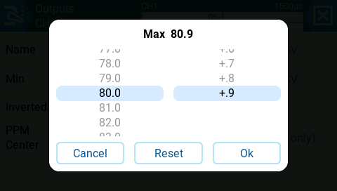 | 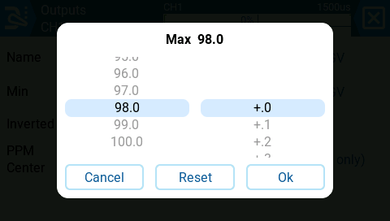 |
| 20 detents from 100.0 land on **80.9** | Same 20 detents land exactly on **98.0** |
| 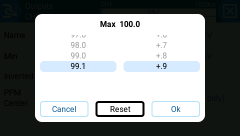 | 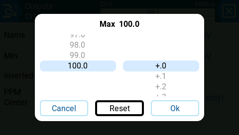 |
| After Reset, roller highlights **99.1** while title says 100.0 | Reset highlights **100.0** correctly |
| 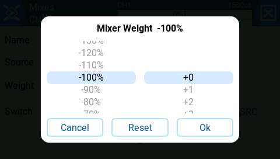 | 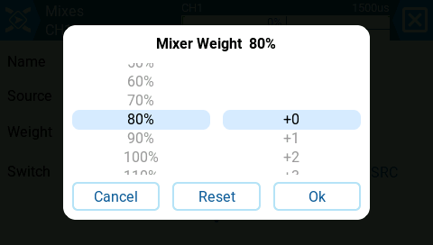 |
| Mixer Weight: 20 detents = −10% each → **−100%** | 20 detents = −1% each → **80%** |

---

## 3. Tap = edit, long-press = context menu, on every list screen

*Branch `worktree-agent-a0712bef9d48f0c5c`, commit `e2076d6231`.*

Ten screens (Outputs, Mixes, Special + Global Functions, Curves, Logical Switches, GVars, Mixer Scripts, Telemetry, Inputs, USB Joystick) opened a context menu on tap and did nothing — or the wrong thing — on long-press, inverting the project convention. Now **tap opens the row's editor directly, long-press opens that row's menu**; ENTER/long-ENTER mirror this automatically.

| After | After |
|---|---|
|  |  |
| Tap on CH1 opens the channel editor directly | Long-press opens CH1's context menu |
| 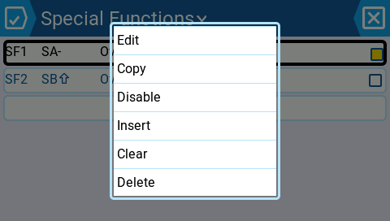 | 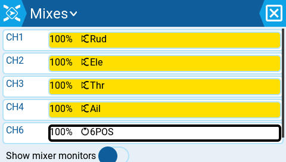 |
| Special Functions long-press opens the **row's** menu (not the old insert-at-slot picker) | Delete from CH5's long-press menu removed only that line |
| 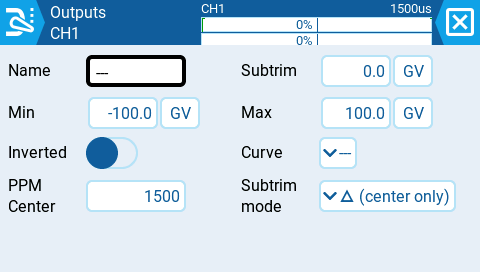 | 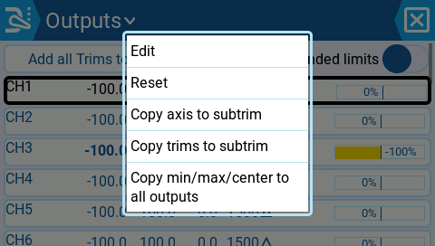 |
| Short ENTER on focused row = edit | Long ENTER = context menu (keyboard path consistent) |

---

## 4. Mis-tap safety: modal dialogs cancel, never commit

*Branch `worktree-agent-a2e00418407802fd0`, commit `2081ab5daf`.*

A tap near a value roller's edge fell through the dialog card and **committed** the previewed value (e.g. saved 190% weight without pressing Ok); taps that missed the small 36×32 filter icons in source pickers dismissed the whole picker. Now the card absorbs its taps, tap-outside is a strict **cancel** that restores the pre-open value, and filter icons have ~52×48 effective touch areas with pixel-identical rendering. Regression checklist covered confirm dialogs (still blocking), keyboard commit, dropdowns, context menus.

| Before | After |
|---|---|
|  | 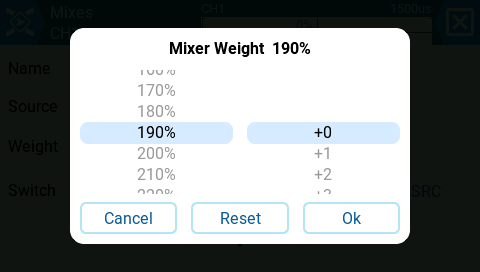 |
| Edge tap closed the dialog and silently **saved 190%** | Same tap: dialog stays open |

| After | After |
|---|---|
|  | 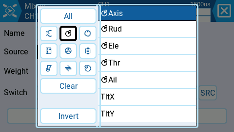 |
| Scrim tap cancels: value back to **100%** | Tap in the previously dead gap now activates the adjacent filter |
| 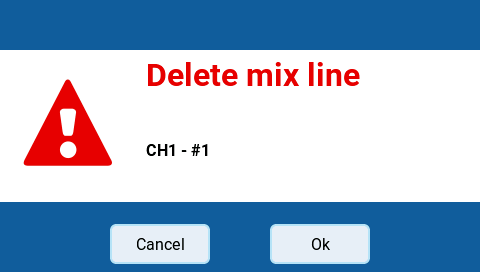 | |
| Blocking confirm dialog is **not** dismissed by an outside tap | |

---

## 5. State-aware theme-token colors; widget color options removed

*Branch `worktree-agent-ac9a8c9a89d0bb683`, commits `015928cf73` (code) / `9916a4943` (proof).*

Widgets no longer offer color options — the theme derives six contrast-guaranteed semantic roles (≥7:1 vs card and screen), and data widgets escalate automatically from already-configured thresholds: battery monitor chemistry bands (35%/20%), timer countdown window, and a new radio-level critical-voltage setting. Safety rule: **never guess chemistry** — an unmonitored voltage sensor gets no state. Also fixed while proving: a pre-existing value truncation (`12.60V` rendered as `12....`) and `vBatCrit` loading as 0 (silently disabling critical alerts) on radios saved before the setting existed.

| | |
|---|---|
| 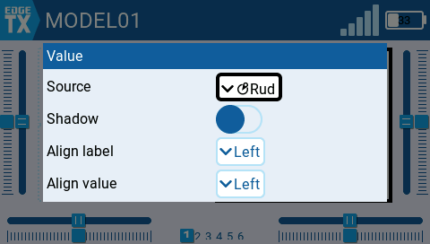 | 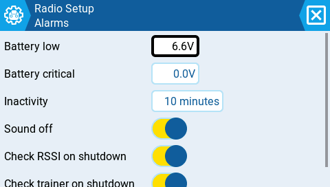 |
| Widget settings: no color option left | New Radio Setup "Battery critical" field |

**Battery escalation** (injected telemetry, 3S LiPo monitor):

| Default | Warning | Critical |
|---|---|---|
| 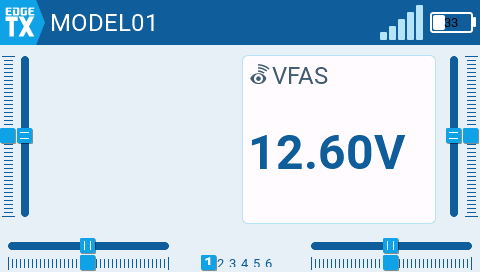 | 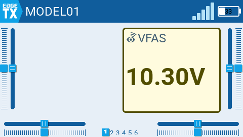 |  |
| 12.60V — navy, full precision | 10.30V — amber text, border, tint | 9.60V — red text, border, tint |

**The no-guessing rule, on screen** (same sensor, same 9.60V):

| With battery monitor | Without battery monitor |
|---|---|
|  | 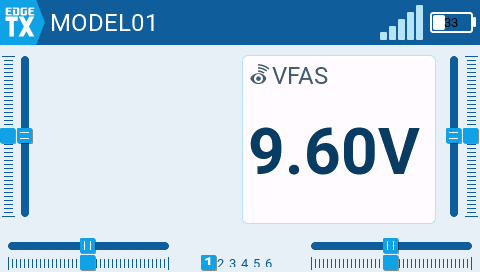 |
| Monitor configured → **Critical** | No monitor → neutral Default, never an estimate |

**Timer, stale telemetry, TX battery:**

| | | |
|---|---|---|
| 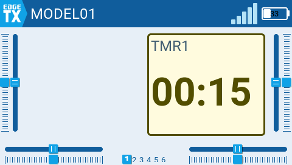 | 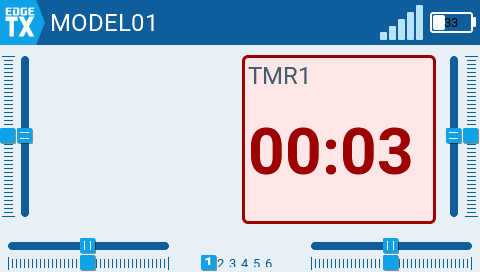 | 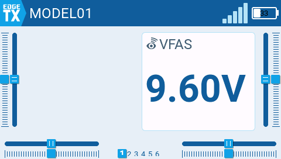 |
| Warning inside countdown window (color agrees with audio) | Expired: digits blink, card cue steady | Stale telemetry → Muted (absence of data ≠ emergency) |

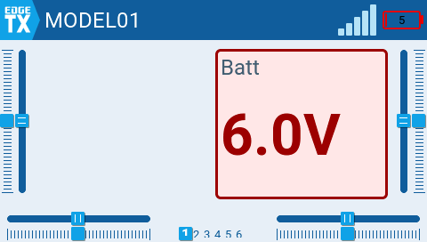

TX battery at 6.0V — below the new critical-voltage setting → Critical.

---

## Change summary

| # | Change | Branch | Commit | Status |
|---|---|---|---|---|
| 1 | Harness touch injection | `main` | `4b0a38942b` | merged + pushed |
| 2 | Rotary detent precision | `worktree-agent-a7028c8ec849fd329` | `b0697798e0` | awaiting merge |
| 3 | Tap/long-press convention (10 screens) | `worktree-agent-a0712bef9d48f0c5c` | `e2076d6231` | awaiting merge |
| 4 | Mis-tap safety (modals cancel) | `worktree-agent-a2e00418407802fd0` | `2081ab5daf` | awaiting merge |
| 5 | State-aware token colors | `worktree-agent-ac9a8c9a89d0bb683` | `015928cf73` | awaiting merge |
