# Edge16 — UX Overhaul Session Report

**2026-07-16/17 · TX16S color LCD (480×272 capacitive touch)**

Everything below started from a full touch-first UX audit (8 field scenarios, ~30 findings), was fixed or built by verified agents, and proven end-to-end in the simulator with raw touch, rotary, and injected telemetry. GIFs are live captures of real interactions.

| # | Change | Status | Commits |
|---|---|---|---|
| 1 | Simulator harness: faithful touch injection | ✅ on `main` + `develop` | `4b0a38942b` |
| 2 | Tap = edit, long-press = menu (all list screens) | ✅ on `develop` | develop's own + convention fixes |
| 3 | Rotary detent precision in value dialogs | ✅ on `develop` | `a917981de6` |
| 4 | Mis-tap safety: modals cancel, never commit | ✅ on `develop` | `ae74136562` |
| 5 | State-aware token colors; widget color options removed | ✅ on `develop` | `39b4079d98` |
| 6 | Name-at-creation + Special Functions enabled by default | ✅ on `develop` | `cb77a30678` |
| 7 | Battery monitoring: inline pack + auto-bind (36→7 taps) | ✅ on `develop` | `3f79d16876` |
| 8 | Enforced design system: DS layer + CI ratchet guard + pilot migration | ✅ accepted, on worktree branch | `5f491bebb0` |

---

## 1. Simulator harness: touch that behaves like a finger

The automation layer blocked the main loop between touch-down and touch-up, so LVGL only ever saw the release — no automated tap ever clicked. Several audit "blockers" (keyboard dead to touch, unresponsive toggles) were this one bug. Fixed with frame-driven gesture injection; it unblocked honest verification of everything else in this report.

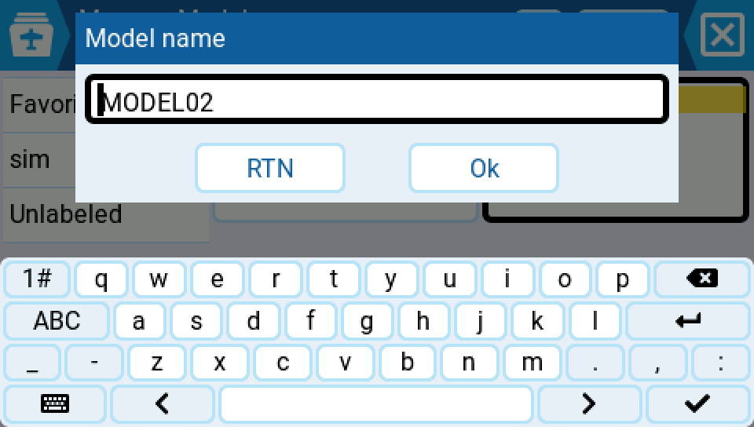

## 2. Tap = edit, long-press = context menu

The most-used screens (Outputs, Mixes, Special Functions, and seven more) opened a context menu on tap and did nothing on long-press — inverted from the project convention. Now a tap goes straight to the editor; long-press opens that row's menu; ENTER/long-ENTER mirror it.

## 3. Rotary detents that land where you aim

Before: from 100.0, the first detent stepped −0.1 and every later one −1.0 — twenty detents landed on **80.9**, and a sticky ".9" made round values unreachable (Mixer Weight was worse: −10% per detent). Root cause: an off-grid roller base plus per-column key handling. Now every detent moves exactly one display-precision step, acceleration stays on-grid, and Reset highlights the true value.

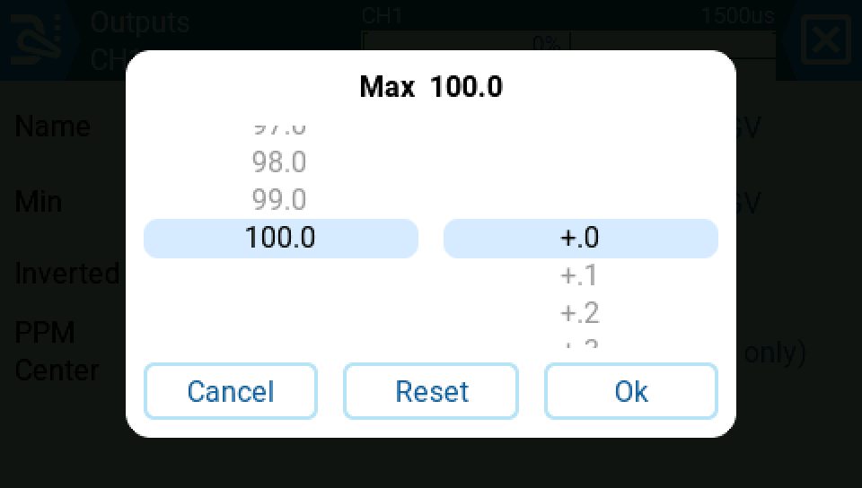

| Before | After |
|---|---|
|  |  |
| 20 detents → **80.9** | Same 20 detents → exactly **98.0** |

## 4. A missed tap can never fly your plane

Before: a tap near a value roller's edge fell through the dialog and silently **committed** the previewed value (190% mix weight saved with no Ok); a near-miss on the tiny 36×32px filter icons dismissed the whole picker. Now dialog cards absorb their own taps, tap-outside is a strict cancel restoring the pre-open value, and filter icons carry ~52×48px effective touch areas with pixel-identical rendering. Blocking confirm dialogs stay blocking.

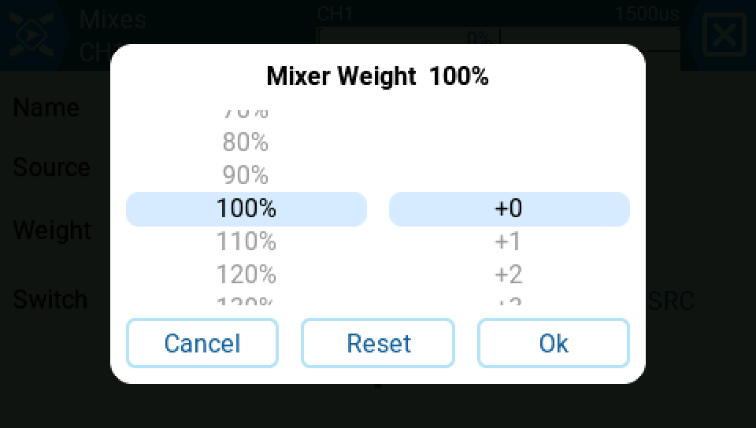

| Before | After |
|---|---|
|  | 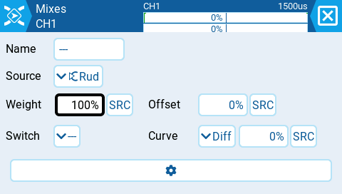 |
| Edge tap silently saved 190% | Scrim tap cancels: back to 100% |

## 5. Color means state, not decoration

Widgets no longer offer color options. The theme derives six contrast-guaranteed roles (≥7:1 against card and screen — chosen for sunlight+sunglasses), and data widgets escalate automatically from thresholds you already configured: battery chemistry bands (35%/20%), the timer countdown window (color agrees with audio), and a new radio-level critical-voltage setting. Warning/Critical add a border + card tint, so the state survives grayscale and color-blindness. **Never guesses**: a voltage sensor with no configured battery monitor stays neutral. Two latent bugs fixed en route: values like "12.60V" truncating to "12....", and pre-existing radios loading critical-voltage as 0 (silently disabling alerts).

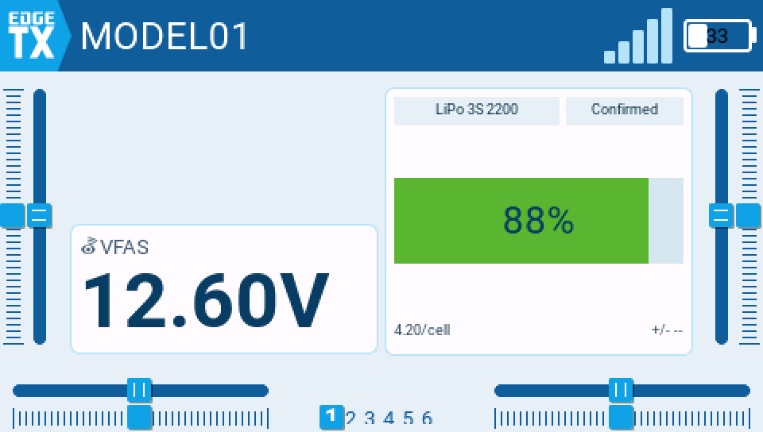

| With monitor (9.60V) | Without monitor (same 9.60V) |
|---|---|
| 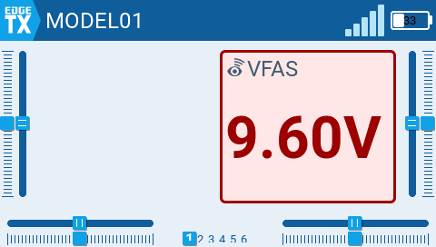 |  |
| Critical — red, border, tint | Neutral — the radio never estimates |

## 6. Create, name, done — and functions that are actually armed

Model creation now prompts for the name immediately, keyboard open, first keystroke a real character (was: 7 backspaces over "MODEL02"; census 25 → 11 interactions). EXIT skips naming without blocking. Special/Global Functions are created **enabled** — and the investigation behind it fixed a real hazard: a zeroed function slot literally defaulted to an *armed channel override*, previously masked only by the disabled flag; new slots now preset to a verified no-op before arming, and picking a function type no longer silently re-disables a fresh slot.

## 7. Battery monitoring: 36 interactions → 7

Before: two top-level menus, a dead-end message, and a chicken-and-egg sensor dependency. Now: "Create battery" lives on the model's Battery page (writing to the radio library and auto-selecting), and when exactly **one** volts sensor exists the monitor binds it automatically — never overwriting an existing binding, never choosing among multiple, never touching chemistry. Dead-end messages now state the fix path.

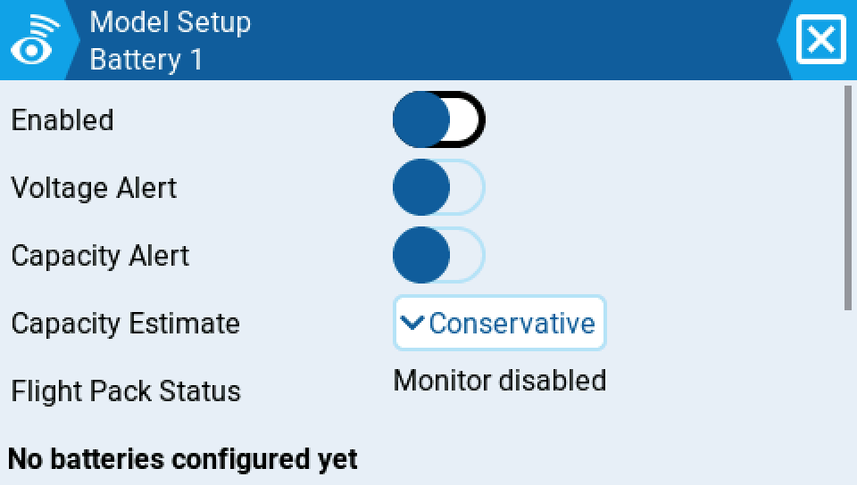

## 8. A design system with teeth

The spacing free-for-all (rows down to 6.3mm, per-screen pixel constants) is now governed: physics-derived rules (128 PPI → 1mm ≈ 5px; **40px/8mm floor** on every touch target, clamped mechanically in the component layer), a semantic-only component API with no padding/margin/position parameters to abuse, and a **CI guard wired into the test suite** — a committed baseline of 1278 legacy violations that may only decrease; any file exceeding its count fails the build. Pilot migration: the Special Functions screen (32px rows → 52px two-line rows, 40×40 toggle hit area — a tap 8px outside the visible checkbox still lands, proven at runtime).

| Before (production) | After (DS pilot) |
|---|---|
| 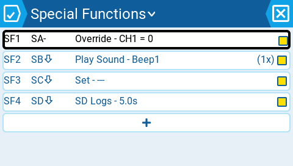 |  |

| Squashed prototype screen | Rebuilt with the system |
|---|---|
|  |  |

## 9. Section headers may never waste a row

Spotted by the owner: a dialog titled "Select role" rendered a "ROLES" header over its only section — pure duplication, half a row lost on a 272px screen. Fixed structurally in the design system: a header is only materialized once a *second* section proves there's something to differentiate, and any header echoing the title (case/plural-insensitive) is suppressed even in multi-section lists. A production-wide sweep confirmed the pattern existed **only** in the DS layer — zero production screens affected — with every kept header documented as genuinely informative.

| One section: headerless | Two sections: headers return | Title echo suppressed |
|---|---|---|
| 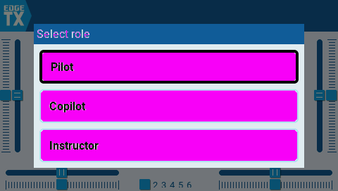 | 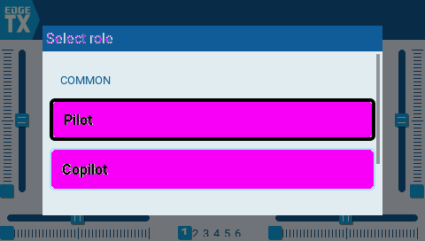 | 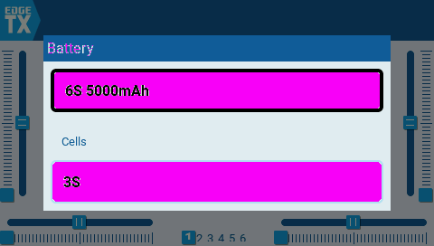 |

---

## Also from this session

- **Full UX audit** (8 scenarios) + tap census (10 tasks, 208 interactions measured) that drove all of the above.
- **Harness improvements** shipped alongside features: new sim automation commands (battery/timer/telemetry setup), touch-typing flow support, faithful raw-touch injection.
- **Design proposals awaiting decision:** [Switch Layout — roles-only + co-assignment + conflicts + voice feedback](https://github.com/onliner10/Edge16/blob/proposal-switch-layout/proposal-swl2/README.md) · [Visibility bridge — timer/battery to home screen, in-field reset](https://github.com/onliner10/Edge16/blob/proposal-visibility-bridge/proposal-vb/README.md) · [Design-system spec + open questions](https://github.com/onliner10/Edge16/blob/proposal-design-system/proposal-ds/README.md)
- **In limbo (stopped mid-work, resumable):** small-fry batch (timer page fold order, recently-used picker ordering, list snap-settle fix) and ui-harness hardening (precondition flow steps, ccache builds, agent guide).
