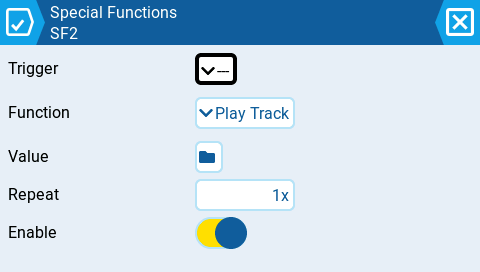
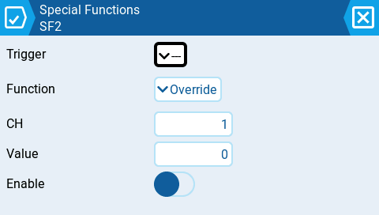
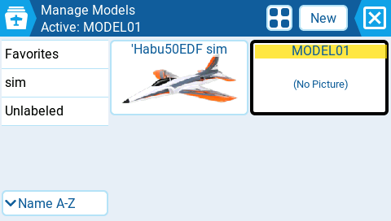
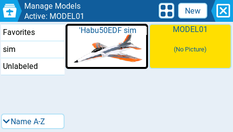
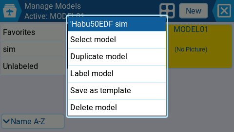
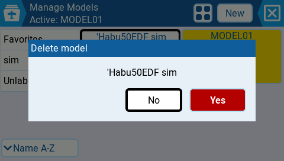
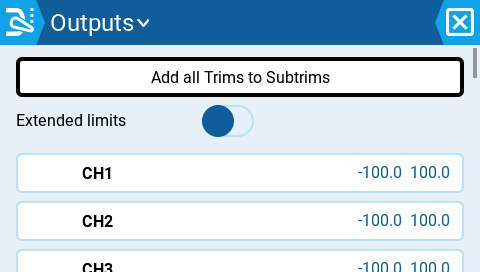
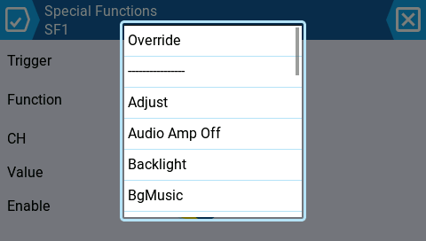

# Simulator verification — soundness fixes

Every screenshot below was captured live in the TX16S simulator built from **develop `f1bcdec19f`** (the commit id is embedded in each screenshot's `.json` sidecar). These confirm the review-driven fixes end-to-end, on top of the 523/523 gtest gate and the clean native + ARM firmware builds.

---

## CRITICAL 1 — Special/Global Functions no longer arm on first pick

A brand-new function slot auto-enables only for announce-only functions; anything that can act on the aircraft/model/radio lands **disabled** until the pilot explicitly enables it.

| Play Track (announce-only) → stays **enabled** | Override Channel (dangerous) → **disabled** |
|---|---|
|  |  |

The right image is the fix: picking **Override Channel** on a fresh slot leaves **Enable OFF** (CH1=0, but inert). Before the fix it armed immediately — forcing CH1 to 0% the next mixer tick if the assigned switch matched. Set Failsafe (available radio-wide via Global Functions) is gated the same way.

---

## CRITICAL 2 — Model Select no longer force-loads on a single tap

`modelQuickSelect` (off by default) is honored again: a tap on a non-active model only **focuses** it; loading needs the confirming tap or the menu.

| Start: MODEL01 active | Single tap on 'Habu → focus only, **still MODEL01 active** | Second tap → **menu** (not a silent load) |
|---|---|---|
|  |  |  |

Middle image is the fix: the focus border moved to 'Habu but **MODEL01 stays the active (yellow) model** — no load. Before the fix, that single tap instantly swapped the active model's entire mix/output/switch config with no confirmation.

---

## #8 — Destructive confirmations use the red role

Delete/reset confirmations now render **YES in red** (destructive) with NO as the safe outline default. Previously YES was the bold blue primary — the dangerous choice looked like the preferred one.

---

## #9 — Outputs list shows the reverse indicator again

| Before (no channel reversed) | After reversing CH1 |
|---|---|
|  |  |

CH1 now shows the reverse glyph (⇄) in a reserved leading slot, so reversed channels are auditable at a glance; CH2/CH3 stay aligned. Before, a reversed channel was indistinguishable in the list.

---

## #10 / #13 — MRU picker: inert divider + no duplicates

The recently-used entry (**Override**) is pinned once at the top, separated by a divider, and is **not** duplicated in its natural alphabetical slot (#13). Tapping the divider row is now a complete no-op — the picker stays open instead of silently dismissing (#10).

---

## Covered by the test gate (not re-shot here)

SD-manager tap consistency + instant-feedback frame, number-wheel touch normalization, battery warn/critical ordering, Logical-Switches live bold cue, and toolbar hit-area — all covered by the 14 new regression tests (523/523 pass) and clean native + ARM builds.
