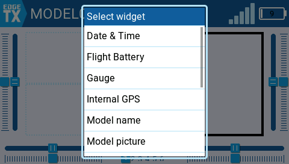
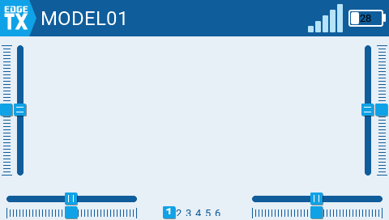
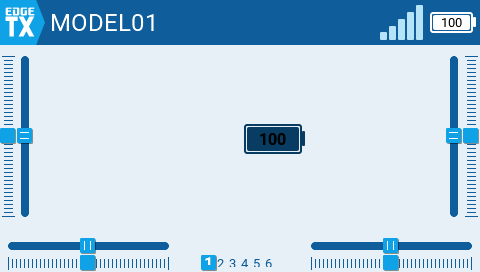
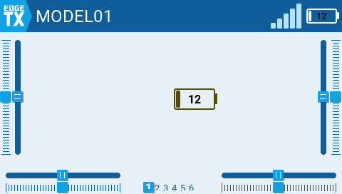
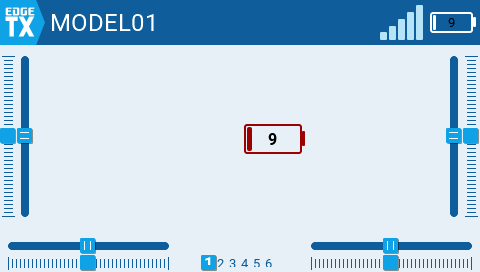

# Simulator verification — widget cleanup + battery-colour fix

Captured live in the TX16S simulator built from **develop `cd5eabaa08`** (commit id is in each screenshot's `.json` sidecar). Fixture thresholds: Battery Warning 6.6V, Battery Critical 6.3V (backfilled).

---

## Widget catalog cleaned up

The Add-Widget picker now reads: **Date & Time, Flight Battery, Gauge, Internal GPS, Model name, Model picture, Outputs, Radio Battery, Signal, Text, Timer, Value, Volume.**

- Renamed for clarity: **Radio Battery** (was "TX Battery" — the transmitter pack), **Flight Battery** (was "Battery Monitor" — the model/telemetry pack), **Signal** (was "Link" — receiver RSSI).
- **Clock** and **Today** are gone — merged into one **Date & Time** widget with a labelled Both/Time/Date format option (the old widgets stay registered so existing layouts keep working, they're just hidden from the picker).
- The dead, unregistered **Radio Info** widget was removed.

---

## TX-battery colour now tracks the configured thresholds (was a hardcoded ~30%)

Previously the topbar/TX-battery surfaces turned **red at ~30% / ~7.0V** with no amber tier — disconnected from the Battery Warning/Critical voltages the pilot configured and from the audio alarm. Now every TX-battery surface uses the single `getTxBatteryAlarm()` source of truth.

**7.0V (28%, above Warning) → normal** — the old "red at 30%" is gone:

Escalation on the large Radio Battery widget, exactly at the configured thresholds (and matching the audio alarm + the Value widget):

| 8.4V (100%) — Normal | 6.6V — Warning (amber) | 6.3V — Critical (red) |
|---|---|---|
|  |  |  |

---

## Also in this batch (covered by the 539-test suite + dual-target build, not re-shot here)
Curve "New" made tappable; Outputs GV-toggle no longer wipes a tuned Min/Max; new-model name committed on RTN; Duplicate Model gets a distinct " 2" name; number-wheel preserves the fine offset across a coarse drag; short settings tile-grid rows left-align; Gauge/Signal state colours; labelled **Both/Time/Date** Date & Time format dropdown.
